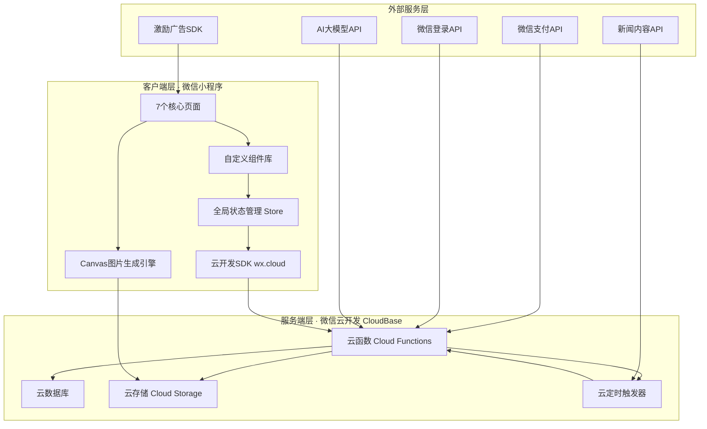
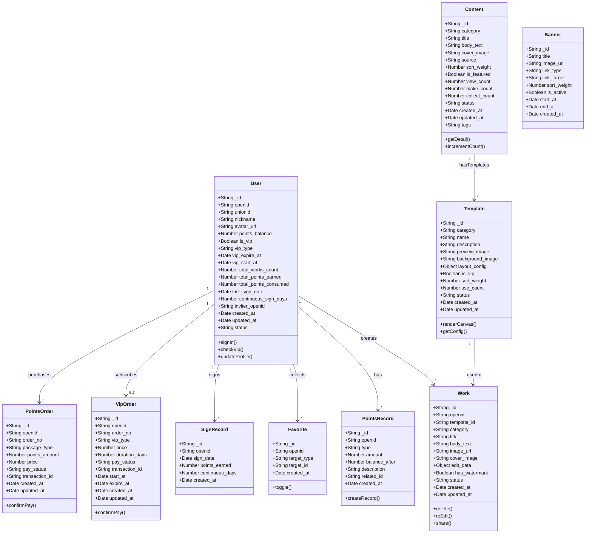
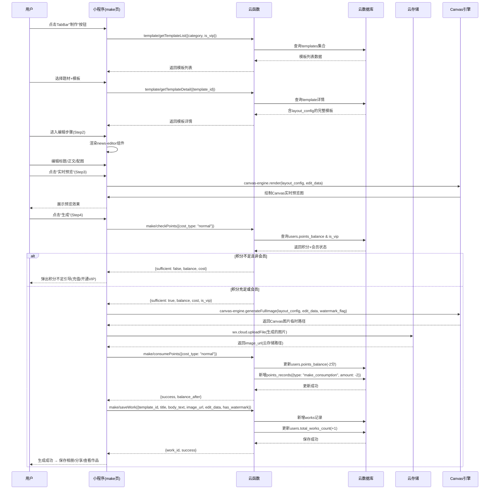
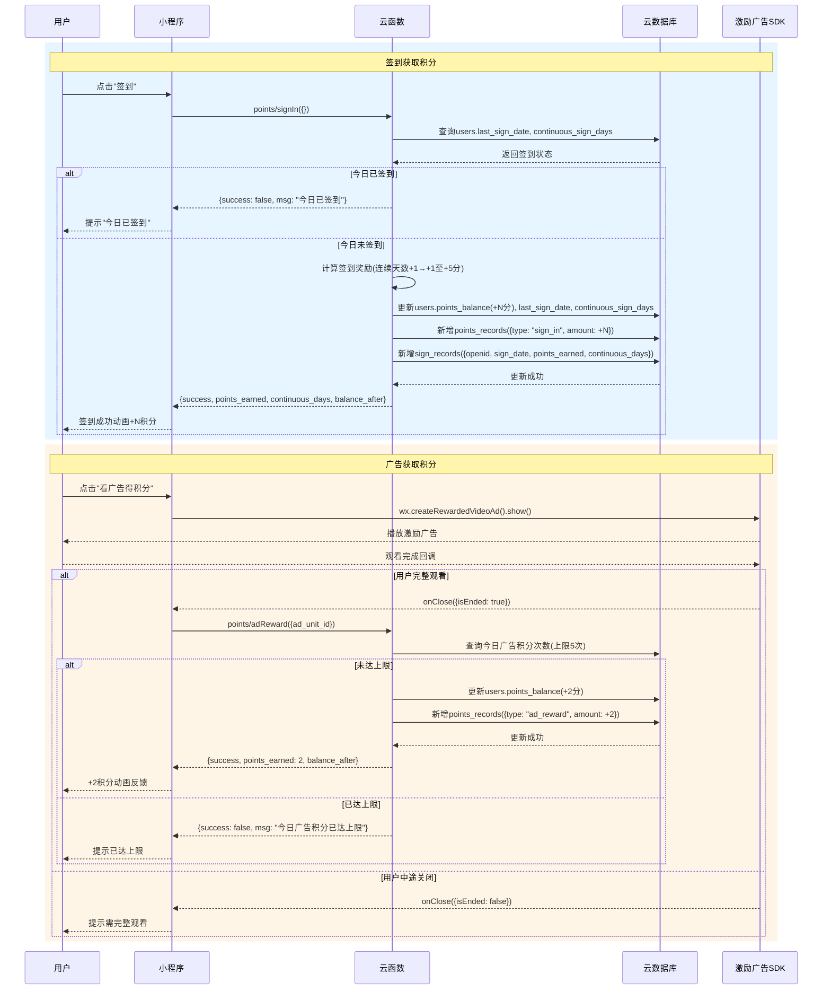
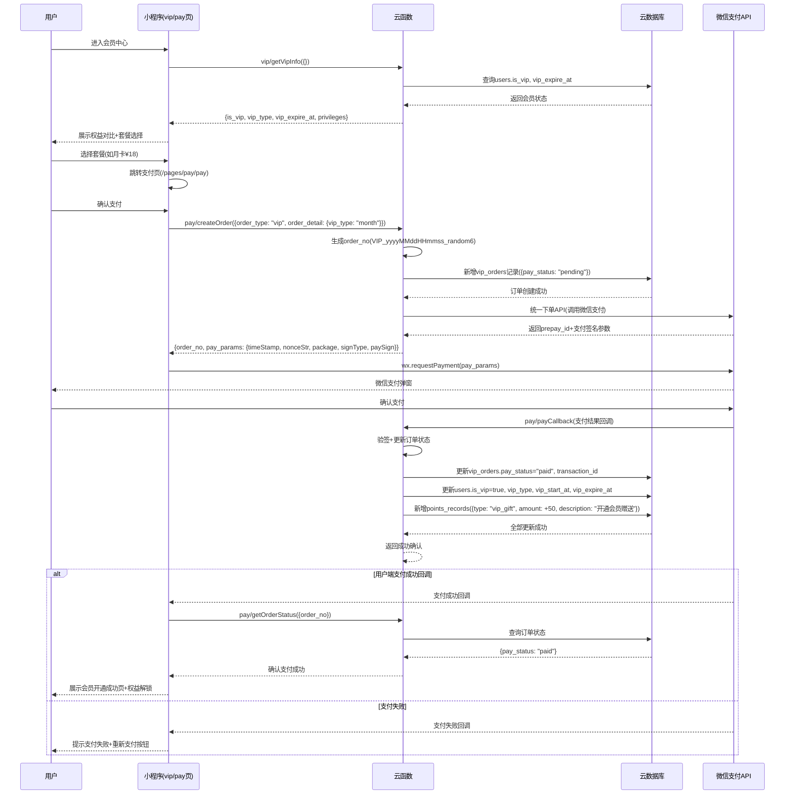
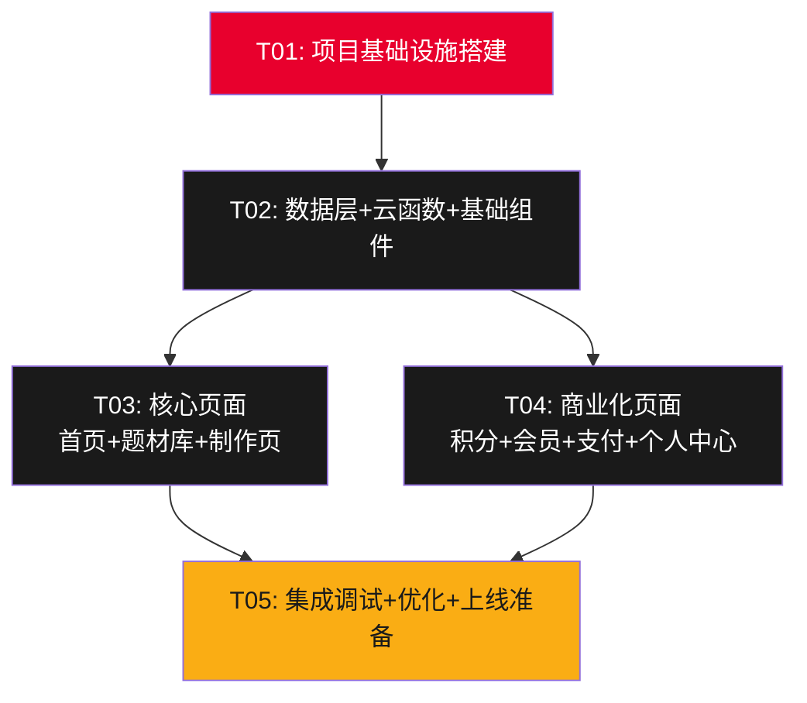

# 系统架构设计文档 · 新闻工坊

| 字段 | 内容 |
|------|------|
| **文档版本** | v1.0 |
| **架构师** | 高见远 |
| **创建日期** | 2025-07-15 |
| **项目代号** | toutiao-news-maker |
| **技术栈** | 微信原生小程序（WXML/WXSS/JS）+ 云开发（CloudBase） |
| **文档状态** | 待评审 |

---

## 目录

1. [实现方案与框架选型](#1-实现方案与框架选型)
2. [文件列表及相对路径](#2-文件列表及相对路径)
3. [数据结构和接口（类图）](#3-数据结构和接口类图)
4. [程序调用流程（时序图）](#4-程序调用流程时序图)
5. [任务列表](#5-任务列表)
6. [依赖包列表](#6-依赖包列表)
7. [共享知识（跨文件约定）](#7-共享知识跨文件约定)
8. [待明确事项](#8-待明确事项)

---

## 1. 实现方案与框架选型

### 1.1 整体技术架构图



### 1.2 前端架构设计

#### 框架选型：微信原生小程序

**选择理由：**

| 对比维度 | 微信原生小程序 | Taro / uni-app 跨端框架 |
|----------|---------------|------------------------|
| 性能 | 直接运行于微信环境，无中间层损耗 | 需经框架编译转换，性能约损失10%-15% |
| 体积控制 | 主包可直接控制在2MB以内，分包灵活 | 框架本身占用约200-400KB |
| 云开发集成 | wx.cloud API原生支持，零配置 | 需手动适配，部分API不可用 |
| Canvas性能 | 原生Canvas 2D API，图片生成高效 | Canvas兼容性问题较多 |
| 开发效率 | 微信DevTools原生调试，体验最优 | 需多端调试，增加调试复杂度 |
| 生态 | 微信生态组件、插件直接可用 | 微信独有功能需条件编译 |

**结论**：本项目为纯微信小程序产品，无跨端需求；核心功能（Canvas图片生成、云开发、微信支付）依赖微信原生API，选择原生小程序是最优方案。

#### 组件化方案

```
组件分层策略
├── 基础组件层（components/base/）
│   ├── news-card        → 新闻卡片（左图右文布局）
│   ├── category-nav     → 题材分类导航
│   ├── template-card    → 模板预览卡片
│   ├── points-card      → 积分余额展示卡片
│   ├── vip-badge        → VIP角标组件
│   └── empty-state      → 空状态占位
│
├── 业务组件层（components/business/）
│   ├── step-progress    → 制作步骤进度条
│   ├── news-editor      → 新闻编辑器（标题+正文+配图）
│   ├── canvas-preview   → Canvas实时预览画布
│   ├── sign-in-card     → 签到打卡卡片
│   ├── ad-reward-btn    → 广告激励按钮
│   └── pay-dialog       → 支付确认弹窗
│
├── 页面级组件（各页面自身内聚）
│   └── 每个页面内部分区通过 <template> 拆分，
│       复用逻辑提取为自定义组件
```

#### 全局状态管理

采用**轻量级全局 Store 方案**（基于 `wx.setStorageSync` + 事件发布订阅），不引入第三方状态管理库：

```javascript
// /utils/store.js — 全局状态管理核心
const Store = {
  _state: {},          // 全局状态对象
  _listeners: {},      // 监听器注册表
  
  getState(key)        // 获取状态
  setState(key, val)   // 设置状态 + 持久化到 Storage
  subscribe(key, cb)   // 注册监听
  unsubscribe(key, cb) // 取消监听
  init()               // 从 Storage 恢复持久化状态
};
```

**需持久化的状态**：用户信息、积分余额、会员状态、签到记录、收藏列表
**非持久化状态**：当前编辑内容、搜索条件、列表分页参数

### 1.3 后端架构设计

#### 方案选择：微信云开发（CloudBase）

**选择理由：**

| 对比维度 | 微信云开发 | 自建服务器（Node.js/Python） |
|----------|-----------|------------------------------|
| 服务器运维 | 零运维，自动扩缩容 | 需自购服务器、配置Nginx、SSL证书等 |
| 微信支付对接 | 云支付原生集成，免商户号配置 | 需申请商户号、配置支付回调、自建验签 |
| 微信登录 | 云开发天然免鉴权，openid自动获取 | 需自建鉴权中间件、维护session |
| 数据库 | 云数据库（文档型）开箱即用 | 需自建MongoDB/MySQL、运维备份 |
| 文件存储 | 云存储开箱即用，CDN自带 | 需自建OSS接入、CDN配置 |
| 开发成本 | 初期0运维成本，按调用计费 | 服务器+带宽+运维人力，月成本≥500元 |
| 冷启动速度 | 云函数冷启动约1-3秒 | 常驻进程，响应更快 |
| 限制 | 单次云函数执行超时20秒（可配至60秒） | 无硬性超时限制 |

**结论**：本项目初期用户量可控（≤1万并发），功能以CRUD+图片生成为主，无长连接需求。云开发零运维、原生集成微信生态API的优势远超自建方案，且云函数20秒超时对图片生成足够（Canvas生成在客户端完成）。

#### 云函数清单规划

```javascript
云函数目录结构
cloudfunctions/
├── user/                    → 用户模块
│   ├── login/               → 微信登录 + 用户信息初始化
│   ├── updateUser/          → 更新用户资料
│   └── deleteUser/          → 账号注销
│
├── content/                 → 内容库模块
│   ├── getContentList/      → 获取题材内容列表（支持分页+排序）
│   ├── searchContent/       → 全文搜索内容
│   ├── getBannerList/       → 获取Banner轮播数据
│   └── collectContent/      → 收藏/取消收藏内容
│
├── template/                → 模板模块
│   ├── getTemplateList/     → 获取模板列表（按题材筛选）
│   ├── getTemplateDetail/   → 获取模板详情
│   └── getVipTemplates/     → 获取VIP专属模板
│
├── make/                    → 制作模块
│   ├── checkPoints/         → 积分余额检查
│   ├── consumePoints/       → 制作消耗积分
│   ├── saveWork/            → 保存作品记录
│   ├── aiRewrite/           → AI改写调用（代理转发）
│   └── getMyWorks/          → 获取我的作品列表
│
├── points/                  → 积分模块
│   ├── signIn/              → 每日签到
│   ├── adReward/            → 广告激励积分发放
│   ├── getPointsDetail/     → 积分流水明细
│   └── buyPoints/           → 购买积分（对接支付）
│
├── vip/                     → 会员模块
│   ├── getVipInfo/          → 获取会员信息+权益
│   ├── subscribeVip/        → 开通/续费会员（对接支付）
│   ├── checkVipStatus/      → 验证会员身份
│   └── vipExpireNotify/     → 到期提醒（定时触发）
│
├── pay/                     → 支付模块
│   ├── createOrder/         → 创建支付订单
│   ├── payCallback/         → 支付结果回调处理
│   └── getOrderStatus/      → 查询订单状态
│
└── admin/                   → 运营管理模块
│   ├── addContent/          → 添加内容（运营后台）
│   ├── addTemplate/         → 添加模板（运营后台）
│   └── contentAudit/        → 内容审核
```

### 1.4 数据存储方案（云数据库设计）

#### 集合规划

| 集合名 | 说明 | 预估数据量 | 主要读写模式 |
|--------|------|-----------|-------------|
| `users` | 用户信息 | 10万+ | 读多写少 |
| `content` | 新闻内容库 | 1万+ | 读多写少（运营批量写入） |
| `templates` | 新闻模板 | 500+ | 读多写少 |
| `works` | 用户作品 | 50万+ | 读写均衡 |
| `points_records` | 积分流水 | 100万+ | 写多读少 |
| `vip_orders` | 会员订单 | 10万+ | 写多读少 |
| `points_orders` | 积分购买订单 | 10万+ | 写多读少 |
| `banners` | Banner轮播 | 50+ | 读多写少 |
| `favorites` | 收藏记录 | 50万+ | 读写均衡 |
| `sign_records` | 签到记录 | 100万+ | 写多读少 |

#### 索引设计

```
users:        { openid: 1 } (唯一), { unionid: 1 }
content:      { category: 1, sort_weight: -1 }, { status: 1, created_at: -1 }, 全文搜索索引(标题+内容)
templates:    { category: 1, is_vip: 1 }, { sort_weight: -1 }
works:        { openid: 1, created_at: -1 }, { openid: 1, status: 1 }
points_records: { openid: 1, created_at: -1 }, { openid: 1, type: 1 }
vip_orders:   { openid: 1, created_at: -1 }, { order_no: 1 } (唯一)
points_orders: { openid: 1, created_at: -1 }, { order_no: 1 } (唯一)
favorites:    { openid: 1, target_id: 1 } (唯一), { openid: 1, created_at: -1 }
sign_records: { openid: 1, date: 1 } (唯一)
```

### 1.5 缓存策略

| 缓存层 | 存储方式 | 缓存内容 | 过期策略 |
|--------|---------|---------|---------|
| **L1: 页面数据缓存** | `wx.setStorageSync` | 用户信息、积分余额、会员状态、签到日期 | 数据变更时主动清除 |
| **L2: 列表数据缓存** | `wx.setStorageSync` | 馘材分类列表、Banner数据、热门内容 | 5分钟过期（会员1分钟） |
| **L3: 模板数据缓存** | `wx.setStorageSync` | 模板列表、模板详情 | 30分钟过期 |
| **L4: 图片资源缓存** | 云存储CDN | 模板背景图、默认配图 | CDN自动管理 |
| **L5: 云数据库缓存** | 云函数内存 | 热点内容排行、签到配置 | 云函数实例生命周期内有效 |

**缓存更新机制**：
- 用户操作类（签到、制作、购买）：操作成功后立即清除相关缓存
- 内容展示类（列表、Banner）：采用过期时间 + 下拉刷新手动触发
- 会员特权类：会员状态变更时清除所有特权相关缓存

---

## 2. 文件列表及相对路径

### 2.1 完整目录结构

```
toutiao-news-maker/
│
├── project.config.json          → 微信开发者工具项目配置
├── app.json                     → 小程序全局配置（页面路由+TabBar+窗口）
├── app.wxss                     → 全局样式（颜色变量+通用样式+字体规范）
├── app.js                       → 小程序入口（云开发初始化+全局Store初始化+登录检查）
├── sitemap.json                 → 小程序索引配置
│
├── cloudfunctions/              → 云函数目录
│   ├── user/
│   │   ├── login/
│   │   │   ├── index.js         → 登录逻辑（获取openid+初始化用户记录）
│   │   │   └── package.json     → 云函数依赖声明
│   │   ├── updateUser/
│   │   │   ├── index.js         → 更新用户资料
│   │   │   └ package.json
│   │   └── deleteUser/
│   │   │   ├── index.js         → 账号注销
│   │   │   └ package.json
│   │
│   ├── content/
│   │   ├── getContentList/
│   │   │   ├── index.js         → 内容列表查询（分页+排序+题材筛选）
│   │   │   └ package.json
│   │   ├── searchContent/
│   │   │   ├── index.js         → 全文搜索
│   │   │   └ package.json
│   │   ├── getBannerList/
│   │   │   ├── index.js         → Banner数据查询
│   │   │   └ package.json
│   │   └── collectContent/
│   │   │   ├── index.js         → 收藏/取消收藏操作
│   │   │   └ package.json
│   │
│   ├── template/
│   │   ├── getTemplateList/
│   │   │   ├── index.js         → 模板列表查询
│   │   │   └ package.json
│   │   ├── getTemplateDetail/
│   │   │   ├── index.js         → 模板详情查询
│   │   │   └ package.json
│   │   └── getVipTemplates/
│   │   │   ├── index.js         → VIP专属模板查询
│   │   │   └ package.json
│   │
│   ├── make/
│   │   ├── checkPoints/
│   │   │   ├── index.js         → 积分余额校验
│   │   │   └ package.json
│   │   ├── consumePoints/
│   │   │   ├── index.js         → 积分扣除（制作消耗）
│   │   │   └ package.json
│   │   ├── saveWork/
│   │   │   ├── index.js         → 保存作品记录
│   │   │   └ package.json
│   │   ├── aiRewrite/
│   │   │   ├── index.js         → AI改写代理（调用大模型API）
│   │   │   └ package.json
│   │   └── getMyWorks/
│   │   │   ├── index.js         → 我的作品列表查询
│   │   │   └ package.json
│   │
│   ├── points/
│   │   ├── signIn/
│   │   │   ├── index.js         → 签到逻辑（连续签到奖励计算）
│   │   │   └ package.json
│   │   ├── adReward/
│   │   │   ├── index.js         → 广告激励积分发放
│   │   │   └ package.json
│   │   ├── getPointsDetail/
│   │   │   ├── index.js         → 积分流水查询
│   │   │   └ package.json
│   │   └── buyPoints/
│   │   │   ├── index.js         → 购买积分（创建订单+支付）
│   │   │   └ package.json
│   │
│   ├── vip/
│   │   ├── getVipInfo/
│   │   │   ├── index.js         → 会员信息+权益查询
│   │   │   └ package.json
│   │   ├── subscribeVip/
│   │   │   ├── index.js         → 会员开通/续费（创建订单+支付）
│   │   │   └ package.json
│   │   ├── checkVipStatus/
│   │   │   ├── index.js         → 验证会员身份有效性
│   │   │   └ package.json
│   │   └── vipExpireNotify/
│   │   │   ├── index.js         → 到期提醒（定时触发器调用）
│   │   │   └ package.json
│   │
│   ├── pay/
│   │   ├── createOrder/
│   │   │   ├── index.js         → 统一创建支付订单
│   │   │   └ package.json
│   │   ├── payCallback/
│   │   │   ├── index.js         → 微信支付回调处理
│   │   │   └ package.json
│   │   └── getOrderStatus/
│   │   │   ├── index.js         → 订单状态查询
│   │   │   └ package.json
│   │
│   └── admin/
│   │   ├── addContent/
│   │   │   ├── index.js         → 批量添加内容
│   │   │   └ package.json
│   │   ├── addTemplate/
│   │   │   ├── index.js         → 添加模板配置
│   │   │   └ package.json
│   │   └── contentAudit/
│   │   │   ├── index.js         → 内容审核处理
│   │   │   └ package.json
│
├── miniprogram/                 → 小程序前端代码（主包）
│   │
│   ├── pages/                   → 页面目录
│   │   ├── home/                → 首页
│   │   │   ├── home.wxml        → 首页模板（搜索+Banner+分类Tab+新闻流）
│   │   │   ├── home.wxss        → 首页样式
│   │   │   ├── home.js          → 首页逻辑（列表加载+搜索+导航）
│   │   │   └ home.json          → 首页配置（引入组件声明）
│   │   │
│   │   ├── category/            → 题材库
│   │   │   ├── category.wxml    → 题材库模板（左导航+右列表+三Tab）
│   │   │   ├── category.wxss    → 题材库样式
│   │   │   ├── category.js      → 题材库逻辑（分类切换+排序+分页）
│   │   │   └ category.json      → 题材库配置
│   │   │
│   │   ├── make/                → 新闻制作（核心页面）
│   │   │   ├── make.wxml        → 制作页模板（4步骤切换+编辑+预览+生成）
│   │   │   ├── make.wxss        → 制作页样式
│   │   │   ├── make.js          → 制作页逻辑（步骤控制+Canvas绑定+积分检查+保存）
│   │   │   └ make.json          → 制作页配置
│   │   │
│   │   ├── points/              → 积分中心
│   │   │   ├── points.wxml      → 积分中心模板（余额+签到+广告+购买+明细）
│   │   │   ├── points.wxss      → 积分中心样式
│   │   │   ├── points.js        → 积分中心逻辑（签到+广告回调+流水查询）
│   │   │   └ points.json        → 积分中心配置
│   │   │
│   │   ├── vip/                 → 会员中心
│   │   │   ├── vip.wxml         → 会员中心模板（权益对比+套餐+开通）
│   │   │   ├── vip.wxss         → 会员中心样式
│   │   │   ├── vip.js           → 会员中心逻辑（权益展示+购买+身份验证）
│   │   │   └ vip.json           → 会员中心配置
│   │   │
│   │   ├── profile/             → 个人中心
│   │   │   ├── profile.wxml     → 个人中心模板（用户信息+作品+收藏+设置）
│   │   │   ├── profile.wxss     → 个人中心样式
│   │   │   ├── profile.js       → 个人中心逻辑（作品列表+收藏+设置操作）
│   │   │   └ profile.json       → 个人中心配置
│   │   │
│   │   ├── pay/                 → 支付页
│   │   │   ├── pay.wxml         → 支付页模板（订单详情+支付按钮+结果）
│   │   │   ├── pay.wxss         → 支付页样式
│   │   │   ├── pay.js           → 支付页逻辑（订单创建+微信支付+结果回调）
│   │   │   └ pay.json           → 支付页配置
│   │
│   ├── components/              → 自定义组件目录
│   │   ├── base/                → 基础UI组件
│   │   │   ├── news-card/       → 新闻卡片组件
│   │   │   │   ├── news-card.wxml
│   │   │   │   ├── news-card.wxss
│   │   │   │   ├── news-card.js
│   │   │   │   └ news-card.json
│   │   │   ├── category-nav/    → 题材分类导航组件
│   │   │   │   ├── category-nav.wxml
│   │   │   │   ├── category-nav.wxss
│   │   │   │   ├── category-nav.js
│   │   │   │   └ category-nav.json
│   │   │   ├── template-card/   → 模板预览卡片组件
│   │   │   │   ├── template-card.wxml
│   │   │   │   ├── template-card.wxss
│   │   │   │   ├── template-card.js
│   │   │   │   └ template-card.json
│   │   │   ├── points-card/     → 积分展示卡片组件
│   │   │   │   ├── points-card.wxml
│   │   │   │   ├── points-card.wxss
│   │   │   │   ├── points-card.js
│   │   │   │   └ points-card.json
│   │   │   ├── vip-badge/       → VIP角标组件
│   │   │   │   ├── vip-badge.wxml
│   │   │   │   ├── vip-badge.wxss
│   │   │   │   ├── vip-badge.js
│   │   │   │   └ vip-badge.json
│   │   │   ├── empty-state/     → 空状态组件
│   │   │   │   ├── empty-state.wxml
│   │   │   │   ├── empty-state.wxss
│   │   │   │   ├── empty-state.js
│   │   │   │   └ empty-state.json
│   │   │
│   │   ├── business/            → 业务功能组件
│   │   │   ├── step-progress/   → 制作步骤进度条组件
│   │   │   │   ├── step-progress.wxml
│   │   │   │   ├── step-progress.wxss
│   │   │   │   ├── step-progress.js
│   │   │   │   └ step-progress.json
│   │   │   ├── news-editor/     → 新闻编辑器组件
│   │   │   │   ├── news-editor.wxml
│   │   │   │   ├── news-editor.wxss
│   │   │   │   ├── news-editor.js
│   │   │   │   └ news-editor.json
│   │   │   ├── canvas-preview/  → Canvas实时预览组件
│   │   │   │   ├── canvas-preview.wxml
│   │   │   │   ├── canvas-preview.wxss
│   │   │   │   ├── canvas-preview.js
│   │   │   │   └ canvas-preview.json
│   │   │   ├── sign-in-card/    → 签到打卡卡片组件
│   │   │   │   ├── sign-in-card.wxml
│   │   │   │   ├── sign-in-card.wxss
│   │   │   │   ├── sign-in-card.js
│   │   │   │   └ sign-in-card.json
│   │   │   ├── ad-reward-btn/   → 广告激励按钮组件
│   │   │   │   ├── ad-reward-btn.wxml
│   │   │   │   ├── ad-reward-btn.wxss
│   │   │   │   ├── ad-reward-btn.js
│   │   │   │   └ ad-reward-btn.json
│   │   │   ├── pay-dialog/      → 支付确认弹窗组件
│   │   │   │   ├── pay-dialog.wxml
│   │   │   │   ├── pay-dialog.wxss
│   │   │   │   ├── pay-dialog.js
│   │   │   │   └ pay-dialog.json
│   │
│   ├── utils/                   → 工具模块目录
│   │   ├── store.js             → 全局状态管理（发布订阅+持久化）
│   │   ├── api.js               → 云函数统一调用封装
│   │   ├── auth.js              → 登录鉴权工具（自动登录+token管理）
│   │   ├── canvas-engine.js     → Canvas图片生成引擎（核心渲染逻辑）
│   │   ├── formatter.js         → 数据格式化工具（时间/积分/会员状态）
│   │   ├── validator.js         → 输入校验工具（标题字数/正文/图片尺寸）
│   │   ├── constants.js         → 全局常量定义（题材/积分规则/颜色/套餐）
│   │   └── share.js             → 分享工具（生成分享卡片+复制文字）
│   │
│   ├── images/                  → 静态图片资源（仅存放不可CDN化的本地图标）
│   │   ├── tab-home.png         → TabBar首页图标
│   │   ├── tab-home-active.png  → TabBar首页选中图标
│   │   ├── tab-category.png     → TabBar题材库图标
│   │   ├── tab-category-active.png
│   │   ├── tab-make.png         → TabBar制作图标
│   │   ├── tab-make-active.png
│   │   ├── tab-points.png       → TabBar积分图标
│   │   ├── tab-points-active.png
│   │   ├── tab-profile.png      → TabBar我的图标
│   │   ├── tab-profile-active.png
│   │   ├── logo.png             → 应用Logo
│   │   ├── watermark.png        → 默认水印图
│   │   └── empty-bg.png         → 空状态背景图
│   │
│   └── styles/                  → 全局样式片段目录
│   │   ├── variables.wxss       → CSS变量定义（颜色/字号/间距/圆角）
│   │   ├── mixins.wxss          → 通用样式混合（卡片/按钮/标签）
│   │   └── animations.wxss      → 动效样式（积分动画/加载动画/切换动画）
│
├── docs/                        → 项目文档目录
│   ├── PRD.md                   → 产品需求文档
│   ├── ARCHITECTURE.md          → 本架构设计文档
│   ├── class-diagram.mermaid    → 类图（数据结构）
│   └── sequence-diagram.mermaid → 时序图（调用流程）
│
└── cloudbaserc.json             → 云开发配置（环境ID+函数配置）
```

---

## 3. 数据结构和接口（类图）

### 3.1 核心数据集合定义



### 3.2 集合字段详细定义（JSON Schema风格）

#### `users` 集合

```json
{
  "_id": "String, 自动生成",
  "openid": "String, 微信openid, 唯一索引",
  "unionid": "String, 微信unionid, 可选",
  "nickname": "String, 用户昵称, 默认'微信用户'",
  "avatar_url": "String, 头像URL, 默认占位图",
  "points_balance": "Number, 积分余额, 默认0",
  "is_vip": "Boolean, 是否会员, 默认false",
  "vip_type": "String, 会员类型(month|quarter|year), 默认null",
  "vip_expire_at": "Date, 会员到期时间, 默认null",
  "vip_start_at": "Date, 会员开始时间, 默认null",
  "total_works_count": "Number, 总作品数, 默认0",
  "total_points_earned": "Number, 总获得积分, 默认0",
  "total_points_consumed": "Number, 总消耗积分, 默认0",
  "last_sign_date": "String, 最后签到日期(YYYY-MM-DD), 默认null",
  "continuous_sign_days": "Number, 连续签到天数, 默认0",
  "inviter_openid": "String, 邀请人openid, 默认null",
  "created_at": "Date, 注册时间",
  "updated_at": "Date, 更新时间",
  "status": "String, 账号状态(active|deleted), 默认active"
}
```

#### `content` 集合

```json
{
  "_id": "String, 自动生成",
  "category": "String, 题材分类(sports|car|agriculture|finance|tech|international|house|entertainment|food)",
  "title": "String, 新闻标题, 最大50字",
  "body_text": "String, 新闻正文内容",
  "cover_image": "String, 封面图URL(云存储)",
  "source": "String, 来源标注, 如'综合报道'",
  "sort_weight": "Number, 排序权重, 默认0",
  "is_featured": "Boolean, 是否精选, 默认false",
  "view_count": "Number, 浏览次数, 默认0",
  "make_count": "Number, 制作次数, 默认0",
  "collect_count": "Number, 收藏次数, 默认0",
  "status": "String, 内容状态(active|pending|rejected|deleted), 默认active",
  "created_at": "Date, 创建时间",
  "updated_at": "Date, 更新时间",
  "tags": "Array<String>, 标签列表"
}
```

#### `templates` 集合

```json
{
  "_id": "String, 自动生成",
  "category": "String, 适用题材分类, '*'表示全题材通用",
  "name": "String, 模板名称",
  "description": "String, 模板描述",
  "preview_image": "String, 模板预览图URL(云存储)",
  "background_image": "String, 模板背景图URL(云存储)",
  "layout_config": "Object, 布局配置(JSON), 含以下子字段:",
  {
    "title_area": {
      "x": "Number, 标题区域x坐标",
      "y": "Number, 标题区域y坐标",
      "width": "Number, 标题区域宽度",
      "height": "Number, 标题区域高度",
      "font_size": "Number, 字号",
      "font_color": "String, 字体颜色",
      "max_length": "Number, 最大字数",
      "align": "String, 对齐方式(left|center|right)"
    },
    "body_area": {
      "x": "Number, 正文区域x坐标",
      "y": "Number",
      "width": "Number",
      "height": "Number",
      "font_size": "Number",
      "font_color": "String",
      "max_length": "Number",
      "line_spacing": "Number, 行间距"
    },
    "image_area": {
      "x": "Number",
      "y": "Number",
      "width": "Number",
      "height": "Number",
      "border_radius": "Number, 圆角",
      "placeholder": "String, 占位图URL"
    },
    "watermark_area": {
      "x": "Number",
      "y": "Number",
      "width": "Number",
      "height": "Number",
      "opacity": "Number, 透明度 0-1"
    },
    "canvas_width": "Number, 画布宽度(1080)",
    "canvas_height": "Number, 画布高度(动态计算)",
    "background_color": "String, 背景颜色"
  },
  "is_vip": "Boolean, 是否VIP专属, 默认false",
  "sort_weight": "Number, 排序权重",
  "use_count": "Number, 使用次数, 默认0",
  "status": "String, 状态(active|deleted), 默认active",
  "created_at": "Date",
  "updated_at": "Date"
}
```

#### `works` 集合

```json
{
  "_id": "String, 自动生成",
  "openid": "String, 创建者openid",
  "template_id": "String, 使用的模板ID",
  "category": "String, 题材分类",
  "title": "String, 作品标题",
  "body_text": "String, 作品正文",
  "image_url": "String, 生成的图片URL(云存储)",
  "cover_image": "String, 配图URL(云存储)",
  "edit_data": "Object, 编辑数据快照(用于再编辑)",
  {
    "title": "String",
    "body_text": "String",
    "cover_image": "String",
    "template_id": "String"
  },
  "has_watermark": "Boolean, 是否带水印, 默认true",
  "status": "String, 状态(active|draft|deleted), 默认active",
  "created_at": "Date",
  "updated_at": "Date"
}
```

#### `points_records` 集合

```json
{
  "_id": "String, 自动生成",
  "openid": "String, 用户openid",
  "type": "String, 类型(sign_in|ad_reward|buy|invite|make_consumption|ai_consumption|vip_gift)",
  "amount": "Number, 积分变动量(正为获得, 负为消耗)",
  "balance_after": "Number, 操作后余额",
  "description": "String, 描述文字",
  "related_id": "String, 关联ID(订单号/作品ID), 可选",
  "created_at": "Date"
}
```

#### `vip_orders` 集合

```json
{
  "_id": "String, 自动生成",
  "openid": "String, 用户openid",
  "order_no": "String, 订单号, 唯一索引, 格式VIP_yyyyMMddHHmmss_random",
  "vip_type": "String, 类型(month|quarter|year)",
  "price": "Number, 支付金额(分), month=1800, quarter=4200, year=12800",
  "duration_days": "Number, 有效天数, month=30, quarter=90, year=365",
  "pay_status": "String, 支付状态(pending|paid|failed|refunded), 默认pending",
  "transaction_id": "String, 微信支付交易号, 可选",
  "start_at": "Date, 会员开始时间",
  "expire_at": "Date, 会员到期时间",
  "created_at": "Date",
  "updated_at": "Date"
}
```

#### `points_orders` 集合

```json
{
  "_id": "String, 自动生成",
  "openid": "String, 用户openid",
  "order_no": "String, 订单号, 唯一索引, 格式PTS_yyyyMMddHHmmss_random",
  "package_type": "String, 套餐类型(trial|standard|premium|pro)",
  "points_amount": "Number, 积分数量, trial=30, standard=100, premium=300, pro=1000",
  "price": "Number, 支付金额(分), trial=300, standard=800, premium=1800, pro=4800",
  "pay_status": "String, 支付状态(pending|paid|failed|refunded), 默认pending",
  "transaction_id": "String, 微信支付交易号, 可选",
  "created_at": "Date",
  "updated_at": "Date"
}
```

### 3.3 云函数接口列表

#### 用户模块

| 接口 | 入参 | 出参 | 说明 |
|------|------|------|------|
| `user/login` | `{ code, nickname?, avatar_url? }` | `{ openid, user_info, is_new }` | 登录并返回用户完整信息 |
| `user/updateUser` | `{ nickname, avatar_url }` | `{ success, user_info }` | 更新用户资料 |
| `user/deleteUser` | `{}` | `{ success }` | 账号注销（标记deleted） |

#### 内容库模块

| 接口 | 入参 | 出参 | 说明 |
|------|------|------|------|
| `content/getContentList` | `{ category, sort_type(featured\|hot\|latest), page, page_size }` | `{ total, list: [{_id, title, cover_image, source, category, view_count, make_count, is_featured}] }` | 获取内容列表，支持分页和排序 |
| `content/searchContent` | `{ keyword, category?, page, page_size }` | `{ total, list }` | 全文搜索，支持标题+正文匹配 |
| `content/getBannerList` | `{}` | `{ list: [{_id, title, image_url, link_type, link_target}] }` | 获取活跃Banner列表 |
| `content/collectContent` | `{ content_id, action(add\|remove) }` | `{ success, collect_count }` | 收藏/取消收藏 |

#### 模板模块

| 接口 | 入参 | 出参 | 说明 |
|------|------|------|------|
| `template/getTemplateList` | `{ category, is_vip?, page, page_size }` | `{ total, list: [{_id, name, preview_image, is_vip, category}] }` | 模板列表 |
| `template/getTemplateDetail` | `{ template_id }` | `{ template: {全部字段} }` | 模板详情含完整layout_config |
| `template/getVipTemplates` | `{ page, page_size }` | `{ total, list }` | VIP专属模板列表 |

#### 制作模块

| 接口 | 入参 | 出参 | 说明 |
|------|------|------|------|
| `make/checkPoints` | `{ cost_type(normal\|ai) }` | `{ sufficient, balance, cost, is_vip }` | 积分余额检查（会员自动通过） |
| `make/consumePoints` | `{ cost_type, work_id? }` | `{ success, balance_after }` | 扣除积分并记录流水 |
| `make/saveWork` | `{ template_id, category, title, body_text, cover_image?, edit_data, has_watermark }` | `{ work_id, success }` | 保存作品记录 |
| `make/aiRewrite` | `{ keyword, original_text?, category }` | `{ rewritten_text, points_consumed }` | AI改写（扣5分） |
| `make/getMyWorks` | `{ page, page_size, status? }` | `{ total, list }` | 我的作品列表 |

#### 积分模块

| 接口 | 入参 | 出参 | 说明 |
|------|------|------|------|
| `points/signIn` | `{}` | `{ success, points_earned, continuous_days, balance_after }` | 每日签到 |
| `points/adReward` | `{ ad_unit_id }` | `{ success, points_earned, balance_after }` | 广告激励积分 |
| `points/getPointsDetail` | `{ page, page_size, type? }` | `{ total, list: [{_id, type, amount, description, created_at}] }` | 积分流水 |
| `points/buyPoints` | `{ package_type }` | `{ order_no, pay_params }` | 创建积分购买订单+返回支付参数 |

#### 会员模块

| 接口 | 入参 | 出参 | 说明 |
|------|------|------|------|
| `vip/getVipInfo` | `{}` | `{ is_vip, vip_type, vip_expire_at, vip_remain_days, privileges }` | 会员信息+权益列表 |
| `vip/subscribeVip` | `{ vip_type }` | `{ order_no, pay_params }` | 开通/续费会员 |
| `vip/checkVipStatus` | `{}` | `{ is_vip, vip_type, vip_expire_at }` | 验证会员有效性（含过期判断） |
| `vip/vipExpireNotify` | `{}` | `{ notified_count }` | 到期提醒推送（定时触发） |

#### 支付模块

| 接口 | 入参 | 出参 | 说明 |
|------|------|------|------|
| `pay/createOrder` | `{ order_type(vip\|points), order_detail }` | `{ order_no, pay_params }` | 统一创建订单+返回微信支付参数 |
| `pay/payCallback` | `{ 从微信回调自动获取 }` | `{ success, order_no }` | 支付结果回调处理 |
| `pay/getOrderStatus` | `{ order_no }` | `{ pay_status, transaction_id }` | 查询订单状态 |

---

## 4. 程序调用流程（时序图）

### 4.1 新闻制作流程



### 4.2 积分消耗流程



### 4.3 会员开通流程



---

## 5. 任务列表

### 5.1 依赖包列表

#### 小程序端依赖

| 包名 | 版本 | 说明 |
|------|------|------|
| 无第三方npm依赖 | — | 微信原生小程序+云开发SDK内置，不引入额外框架 |

> **设计决策**：本项目采用纯微信原生小程序开发，所有核心能力（云开发、支付、登录、Canvas）均由微信内置SDK提供。不引入任何第三方npm包，确保包体积可控（主包≤2MB）且兼容性最优。

#### 云函数端依赖

| 包名 | 版本 | 用途 | 所在云函数 |
|------|------|------|-----------|
| `wx-server-sdk` | ^2.6.3 | 微信云开发服务端SDK | 所有云函数 |
| `tencentcloud-sdk-nodejs` | ^4.0.3 | 腾讯云SDK（调用AI大模型API） | `make/aiRewrite` |
| `crypto` | 内置 | 订单号生成+支付验签 | `pay/createOrder`, `pay/payCallback` |

### 5.2 任务详情

---

#### T01: 项目基础设施搭建

| 属性 | 内容 |
|------|------|
| **任务ID** | T01 |
| **任务名称** | 项目基础设施搭建 |
| **优先级** | P0 |
| **依赖任务** | 无 |
| **预估复杂度** | 低 |
| **涉及文件** | `project.config.json`, `app.json`, `app.js`, `app.wxss`, `sitemap.json`, `cloudbaserc.json`, `utils/store.js`, `utils/api.js`, `utils/auth.js`, `utils/constants.js`, `utils/formatter.js`, `utils/validator.js`, `utils/share.js`, `styles/variables.wxss`, `styles/mixins.wxss`, `styles/animations.wxss`, `miniprogram/images/`（全部TabBar图标+logo+watermark+empty-bg） |

**任务描述**：

搭建项目骨架，完成微信开发者工具可运行的最小配置：

1. **项目配置文件**：`project.config.json`（AppID、云开发环境配置）、`cloudbaserc.json`（云环境ID）、`sitemap.json`
2. **全局入口**：`app.json`（7个页面路由注册+TabBar配置5个入口+窗口样式）、`app.js`（云开发初始化`wx.cloud.init()`+全局Store初始化+登录检查）、`app.wxss`（引入`styles/`下3个样式片段+全局通用样式）
3. **核心工具模块**：
   - `utils/store.js` — 全局状态管理（发布订阅+Storage持久化）
   - `utils/api.js` — 云函数统一调用封装（`callCloudFunc(name, data)` → 返回Promise）
   - `utils/auth.js` — 登录鉴权（自动silentLogin+openid缓存+会员状态检查）
   - `utils/constants.js` — 全局常量（9大题材映射、积分规则、颜色常量、套餐配置、VIP套餐配置）
   - `utils/formatter.js` — 数据格式化（时间格式化、积分显示、会员到期天数）
   - `utils/validator.js` — 输入校验（标题50字限制、正文限制、图片尺寸校验）
   - `utils/share.js` — 分享工具（生成onShareAppMessage参数+复制文字）
4. **全局样式**：`styles/variables.wxss`（颜色/字号/间距CSS变量）、`styles/mixins.wxss`（卡片/按钮/标签通用样式）、`styles/animations.wxss`（积分动画/加载动画）
5. **静态资源**：`miniprogram/images/`下全部10个TabBar图标（5组normal+active）+logo+水印+空状态背景图

**验收标准**：开发者工具可正常编译运行，TabBar可见（5个入口含中间突出"制作"按钮），云开发环境连通。

---

#### T02: 数据层 + 云函数 + 基础组件

| 属性 | 内容 |
|------|------|
| **任务ID** | T02 |
| **优先级** | P0 |
| **依赖任务** | T01 |
| **预估复杂度** | 高 |
| **涉及文件** | `cloudfunctions/`下全部云函数（user、content、template、make、points、vip、pay、admin共20+个函数），`components/base/`下全部6个基础组件（news-card、category-nav、template-card、points-card、vip-badge、empty-state），`utils/canvas-engine.js` |

**任务描述**：

实现后端数据层和前端基础UI组件：

1. **云函数开发**（20+个函数，每个含`index.js`+`package.json`）：
   - **user模块**：login（openid获取+用户初始化）、updateUser、deleteUser
   - **content模块**：getContentList（分页+题材筛选+排序）、searchContent（全文搜索）、getBannerList、collectContent
   - **template模块**：getTemplateList、getTemplateDetail（含完整layout_config）、getVipTemplates
   - **make模块**：checkPoints（余额+会员验证）、consumePoints（扣除+流水记录）、saveWork（作品保存+计数更新）、aiRewrite（大模型API代理）、getMyWorks
   - **points模块**：signIn（连续签到奖励计算+防重复）、adReward（频率限制5次/天）、getPointsDetail、buyPoints（订单创建+支付参数）
   - **vip模块**：getVipInfo、subscribeVip（订单+支付）、checkVipStatus（过期判断）、vipExpireNotify（定时推送）
   - **pay模块**：createOrder（统一下单+微信支付参数生成）、payCallback（验签+订单状态更新+业务状态更新）、getOrderStatus
   - **admin模块**：addContent、addTemplate、contentAudit
2. **云数据库初始化**：创建10个集合+索引配置+初始数据导入（9大题材各50条内容+50个模板配置）
3. **基础UI组件**（6个）：
   - `news-card` — 左图右文新闻卡片（封面图+标题2行+来源时间热度）
   - `category-nav` — 横向/纵向题材分类导航（9大题材+选中态）
   - `template-card` — 模板预览卡片（预览图+名称+VIP角标）
   - `points-card` — 积分余额展示卡片（数字+操作按钮）
   - `vip-badge` — VIP金色角标（不同尺寸适配）
   - `empty-state` — 空状态占位（图标+提示文字）
4. **Canvas引擎核心**：`utils/canvas-engine.js` — 图片生成核心模块：
   - `renderPreview(layout_config, edit_data)` → Canvas绑定+实时绘制
   - `generateFullImage(layout_config, edit_data, watermark_flag)` → 全尺寸图片生成+水印处理
   - `saveToAlbum(canvasTempFilePath)` → 调用`wx.saveImageToPhotosAlbum()`

**验收标准**：云函数可独立调用测试返回正确数据；基础组件可在页面中渲染展示；Canvas引擎可绘制模板预览图。

---

#### T03: 核心页面开发（首页 + 题材库 + 制作页）

| 属性 | 内容 |
|------|------|
| **任务ID** | T03 |
| **优先级** | P0 |
| **依赖任务** | T02 |
| **预估复杂度** | 高 |
| **涉及文件** | `pages/home/`（4文件）、`pages/category/`（4文件）、`pages/make/`（4文件）、`components/business/step-progress/`（4文件）、`components/business/news-editor/`（4文件）、`components/business/canvas-preview/`（4文件） |

**任务描述**：

开发3个核心业务页面及其专用业务组件：

1. **首页 `/pages/home/home`**：
   - 顶部搜索栏+通知图标（搜索跳转题材库搜索模式）
   - Banner轮播区（swiper组件+云函数数据加载+点击跳转）
   - 题材分类横向Tab（使用category-nav组件+切换筛选）
   - 新闻流卡片列表（使用news-card组件+分页加载+下拉刷新+触底加载更多）
   - 搜索功能（输入关键词→调用searchContent→展示结果列表）
2. **题材库 `/pages/category/category`**：
   - 左侧9大题材纵向导航（选中态红色高亮+滚动定位）
   - 右侧内容列表（精选/热门/最新三Tab切换+分页）
   - 点击内容卡片→跳转制作页（携带content_id参数）
   - 搜索入口（顶部搜索框→搜索模式切换）
3. **新闻制作 `/pages/make/make`**（核心页面，最复杂）：
   - Step进度条（使用step-progress组件，4步：选模板→编辑→预览→生成）
   - **Step1 选模板**：题材分类+模板网格列表（使用template-card）+VIP模板解锁提示
   - **Step2 编辑**：news-editor组件（标题输入50字限制+正文编辑+配图选择`wx.chooseImage`+AI改写按钮）
   - **Step3 预览**：canvas-preview组件（实时Canvas渲染+可缩放查看）
   - **Step4 生成分享**：积分确认弹窗→Canvas全图生成→云存储上传→作品保存→分享操作（保存相册/转发卡片/复制文字）
4. **业务组件**（3个）：
   - `step-progress` — 4步骤进度指示条（当前步骤高亮+可回退）
   - `news-editor` — 新闻编辑器（标题/正文输入+字数统计+配图选择+AI改写入口）
   - `canvas-preview` — Canvas实时预览画布（绑定canvas引擎+数据响应式绘制）

**验收标准**：3个页面完整交互流程可走通：首页浏览→题材库筛选→制作4步全流程→生成图片可保存。

---

#### T04: 商业化页面开发（积分 + 会员 + 支付 + 个人中心）

| 属性 | 内容 |
|------|------|
| **任务ID** | T04 |
| **优先级** | P0 |
| **依赖任务** | T02 |
| **预估复杂度** | 中 |
| **涉及文件** | `pages/points/`（4文件）、`pages/vip/`（4文件）、`pages/pay/`（4文件）、`pages/profile/`（4文件）、`components/business/sign-in-card/`（4文件）、`components/business/ad-reward-btn/`（4文件）、`components/business/pay-dialog/`（4文件） |

**任务描述**：

开发4个商业化相关页面及其专用组件：

1. **积分中心 `/pages/points/points`**：
   - 积分余额卡片（使用points-card组件+数字动效）
   - 签到打卡区（sign-in-card组件+连续签到进度展示+签到按钮+已签到状态）
   - 广告激励区（ad-reward-btn组件+今日剩余次数提示+点击触发广告SDK）
   - 积分购买入口（4档套餐卡片→跳转支付页）
   - 积分流水明细列表（时间倒序+类型标签+正负颜色区分+分页加载）
2. **会员中心 `/pages/vip/vip`**：
   - 会员权益对比表（普通 vs 会员：无限制使用/无水印/专属模板/AI改写/优先更新）
   - 套餐选择卡片（月卡¥18/季卡¥42/年卡¥128+日均成本计算+推荐标记）
   - 开通/续费按钮（当前会员状态展示+到期天数+续费入口→跳转支付页）
3. **支付页 `/pages/pay/pay`**：
   - 订单详情展示（订单类型+金额+商品描述）
   - 微信支付按钮（调用`wx.requestPayment`）
   - 支付结果反馈（成功页/失败页+重试按钮+查看订单）
   - pay-dialog组件（支付确认弹窗+订单摘要+确认按钮）
4. **个人中心 `/pages/profile/profile`**：
   - 用户信息区（头像+昵称+会员角标+编辑入口）
   - 积分余额+会员状态快捷入口
   - 我的作品列表（使用news-card变体+删除/再编辑/分享操作）
   - 我的收藏列表（收藏的内容+模板+取消收藏）
   - 设置区（通知开关+客服入口+隐私协议+账号注销）

**验收标准**：签到可正常加分+流水记录正确；广告观看+积分发放正常；会员开通→微信支付→状态更新全链路可走通；个人中心数据展示正确。

---

#### T05: 集成调试 + 优化 + 上线准备

| 属性 | 内容 |
|------|------|
| **任务ID** | T05 |
| **优先级** | P0 |
| **依赖任务** | T03, T04 |
| **预估复杂度** | 中 |
| **涉及文件** | `app.js`（最终集成调整）、`app.json`（分包配置优化）、`app.wxss`（全局样式微调）、`utils/store.js`（缓存策略优化）、`utils/api.js`（错误处理增强）、`utils/canvas-engine.js`（性能优化）、各页面JS（交互细节打磨+异常处理） |

**任务描述**：

全链路集成、性能优化和上线准备：

1. **分包配置优化**：将部分页面移入分包以控制主包体积≤2MB：
   - 主包：首页+题材库+TabBar+全局配置+工具模块+基础组件
   - 分包1（make-subpkg）：制作页+制作相关业务组件+Canvas引擎
   - 分包2（biz-subpkg）：积分中心+会员中心+支付页+个人中心+商业化组件
2. **缓存策略完善**：
   - 列表数据缓存过期机制（普通5分钟/会员1分钟）
   - 用户操作后主动清除关联缓存
   - 下拉刷新强制更新
3. **性能优化**：
   - Canvas图片生成性能（离屏Canvas+分步绘制+大图异步生成）
   - 列表渲染优化（按需渲染+懒加载+图片懒加载）
   - 云函数调用优化（批量接口合并+缓存减少重复调用）
4. **异常处理增强**：
   - 云函数调用失败重试机制（3次重试+友好提示）
   - 网络断线状态检测+提示
   - 支付超时处理+订单状态兜底查询
5. **上线准备**：
   - 隐私协议配置（`__privacy__`）
   - 用户信息授权弹窗适配
   - 小程序体验版测试+正式版提审
   - 初始内容数据批量导入（9题材×50条内容+50模板）

**验收标准**：主包体积≤2MB；首屏加载≤2秒；制作全流程≤60秒；支付链路稳定；小程序可正式提审上线。

---

### 5.3 任务依赖图



---

## 7. 共享知识（跨文件约定）

### 7.1 命名规范

| 类别 | 规范 | 示例 |
|------|------|------|
| **页面文件** | 与页面路径同名，4件套(wxml/wxss/js/json) | `pages/home/home.wxml` |
| **组件文件** | 与组件名同名，4件套 | `components/base/news-card/news-card.js` |
| **云函数** | 模块名/功能名，每个含index.js+package.json | `cloudfunctions/user/login/index.js` |
| **工具模块** | 驼峰命名，导出对象或class | `utils/canvasEngine.js` → `CanvasEngine` |
| **云数据库集合** | 小写+下划线，复数形式 | `users`, `points_records`, `vip_orders` |
| **CSS类名** | BEM风格：block__element--modifier | `.news-card__title--featured` |
| **全局常量** | 大写+下划线 | `CATEGORY_LIST`, `POINTS_COST_NORMAL` |
| **订单号** | 类型前缀+时间戳+随机数 | `VIP_20250715143000_a3b2c1`, `PTS_20250715143000_x9y8z7` |

### 7.2 颜色常量

```javascript
// utils/constants.js 中定义
const COLORS = {
  PRIMARY_RED: '#E8002D',     // 主红（头条红）
  DARK_BLACK: '#1A1A1A',      // 深黑（主文字）
  BG_GRAY: '#F5F5F5',         // 页面背景
  CARD_WHITE: '#FFFFFF',      // 卡片白
  VIP_GOLD: '#FAAD14',        // VIP金色
  SUCCESS_GREEN: '#07C160',   // 成功绿
  WARN_ORANGE: '#FA8C16',     // 警示橙
  TEXT_PRIMARY: '#1A1A1A',    // 主文字色
  TEXT_SECONDARY: '#666666',  // 辅文字色
  TEXT_HINT: '#999999',       // 提示文字色
  BORDER_LIGHT: '#E5E5E5',   // 分割线色
};
```

```css
/* styles/variables.wxss 中定义 */
/* 颜色变量 */
page {
  --color-primary: #E8002D;
  --color-dark: #1A1A1A;
  --color-bg: #F5F5F5;
  --color-card: #FFFFFF;
  --color-vip: #FAAD14;
  --color-success: #07C160;
  --color-warn: #FA8C16;
  --color-text-primary: #1A1A1A;
  --color-text-secondary: #666666;
  --color-text-hint: #999999;
  --color-border: #E5E5E5;
  
  /* 字号变量 */
  --font-title: 17px;
  --font-subtitle: 15px;
  --font-body: 14px;
  --font-hint: 12px;
  
  /* 圆角变量 */
  --radius-card: 8px;
  --radius-button: 4px;
  --radius-tag: 12px;
  
  /* 间距变量 */
  --spacing-xs: 4px;
  --spacing-sm: 8px;
  --spacing-md: 12px;
  --spacing-lg: 16px;
  --spacing-xl: 24px;
}
```

### 7.3 API调用约定

```javascript
// utils/api.js — 统一云函数调用封装
// 所有页面通过 api.js 调用云函数，禁止直接 wx.cloud.callFunction

const api = {
  /**
   * 统一调用云函数
   * @param {string} name - 云函数路径，如 'user/login'
   * @param {object} data - 入参对象
   * @returns {Promise<{code, data, message}>}
   */
  async callCloudFunc(name, data = {}) {
    try {
      const res = await wx.cloud.callFunction({
        name: name.replace('/', '-'),  // 云函数名用横杠分隔
        data
      });
      const result = res.result;
      if (result.code === 0) {
        return result;  // { code: 0, data: {...}, message: 'ok' }
      } else {
        // 业务错误统一处理
        wx.showToast({ title: result.message || '操作失败', icon: 'none' });
        return result;
      }
    } catch (err) {
      // 网络错误统一处理
      wx.showToast({ title: '网络异常，请重试', icon: 'none' });
      return { code: -1, data: null, message: err.message };
    }
  }
};
```

**所有云函数返回格式统一**：
```json
{
  "code": 0,        // 0=成功, -1=系统错误, 1=业务错误(如积分不足)
  "data": {},       // 业务数据
  "message": "ok"   // 描述文字
}
```

### 7.4 状态管理约定

| 数据类别 | 存储方式 | 读取时机 | 更新时机 |
|----------|---------|---------|---------|
| 用户基本信息 | `Store.setState('userInfo', data)` | `app.js onLaunch`自动登录 | 登录/编辑资料后 |
| 积分余额 | `Store.setState('pointsBalance', num)` | 进入积分中心/制作页 | 签到/广告/制作/购买后 |
| 会员状态 | `Store.setState('vipStatus', obj)` | `app.js onLaunch` | 开通/续费/过期后 |
| 签到日期 | `Store.setState('lastSignDate', str)` | 进入积分中心 | 签到成功后 |
| 编辑草稿 | `Store.setState('draftData', obj)`，不持久化 | 进入制作页 | 编辑内容变更 |
| 列表分页参数 | 页面自身data管理，不持久化 | 列表加载 | 分页切换 |

### 7.5 安全约定

| 类别 | 约定 |
|------|------|
| **openid获取** | 所有云函数通过 `wx-server-sdk` 的 `OPENID` 常量获取，禁止客户端传入 |
| **支付验签** | `pay/payCallback` 云函数必须进行微信支付签名验证，防止伪造回调 |
| **积分防刷** | 签到按 openid+日期 唯一索引防重复；广告积分按 openid+日期+次数 限制上限5次 |
| **内容过滤** | 用户自定义标题/正文在 `make/saveWork` 云函数中经过敏感词检测后再入库 |
| **频率限制** | 云函数入口统一添加调用频率检查（同一openid每秒≤5次调用） |

### 7.6 Canvas图片生成约定

| 参数 | 约定 |
|------|------|
| **画布宽度** | 固定1080px（适配所有手机屏幕，显示时按屏幕宽度缩放） |
| **画布高度** | 由模板layout_config动态计算（正文区域高度随内容长度自适应） |
| **输出格式** | PNG格式，质量0.9 |
| **水印规格** | 普通用户：右下角"新闻工坊"水印，透明度0.3，字号20px；会员用户：无水印 |
| **配图尺寸** | 最大1200×800px，超过自动缩放；云存储上传后获取URL |

---

## 8. 待明确事项

| # | 事项 | 影响范围 | 当前假设 | 需决策方 |
|---|------|----------|---------|---------|
| 1 | **内容来源策略**：新闻内容库是接入第三方API（聚合数据/天行数据）还是自建AI生成？ | 云函数content模块、admin模块、内容合规性 | 假设初版采用运营手动+AI辅助生成，通过admin云函数批量导入 | 产品+法务 |
| 2 | **AI大模型选型**：AI改写功能使用哪家API（文心/通义/GPT）？调用成本与积分定价如何匹配？ | `make/aiRewrite`云函数、积分消耗规则 | 假设使用通义千问API（国内合规+成本可控），AI改写消耗5积分 | 产品+技术 |
| 3 | **新用户积分赠送**：新注册是否赠送初始积分（如10分）？ | `user/login`云函数、用户转化率 | 假设新用户赠送10积分（在login云函数中初始化） | 产品+运营 |
| 4 | **内容审核机制**：用户自定义内容是否需要入库审核？审核延迟如何处理？ | `make/saveWork`云函数、用户体验 | 假设初版采用AI敏感词自动检测+高危内容人工复审，检测延迟≤2秒 | 产品+法务 |
| 5 | **水印视觉方案**：普通用户水印的具体位置、样式、透明度？ | `canvas-engine.js`水印绘制逻辑 | 假设右下角半透明文字水印"新闻工坊出品"，30%透明度 | 产品+设计 |
| 6 | **会员自动续费**：是否上线连续包月自动续费？需微信特殊审核流程 | `vip/subscribeVip`云函数、支付模块 | 假设初版不支持自动续费，仅手动续费，后续版本迭代 | 产品+技术 |
| 7 | **图片生成分辨率上限**：生成的新闻图片最大分辨率和文件大小限制？ | `canvas-engine.js`、云存储 | 假设画布宽1080px，高度动态计算最大3000px，PNG文件≤5MB | 技术 |
| 8 | **题材扩展机制**：9大题材之后是否规划更多？扩展时数据结构是否需要调整？ | `constants.js`题材映射、content集合 | 假设初版固定9大题材，数据结构设计为可扩展（category字段为String而非Enum） | 产品+运营 |
| 9 | **小程序体验版测试账号**：云开发环境需要配置测试账号，谁负责？ | 开发流程 | 假设由技术负责人配置云开发环境+测试白名单 | 技术 |

---

*文档由架构师 高见远 编写，版本 v1.0，2025-07-15*
*如有疑问请通过项目协作系统反馈，重大变更需重新评审。*
