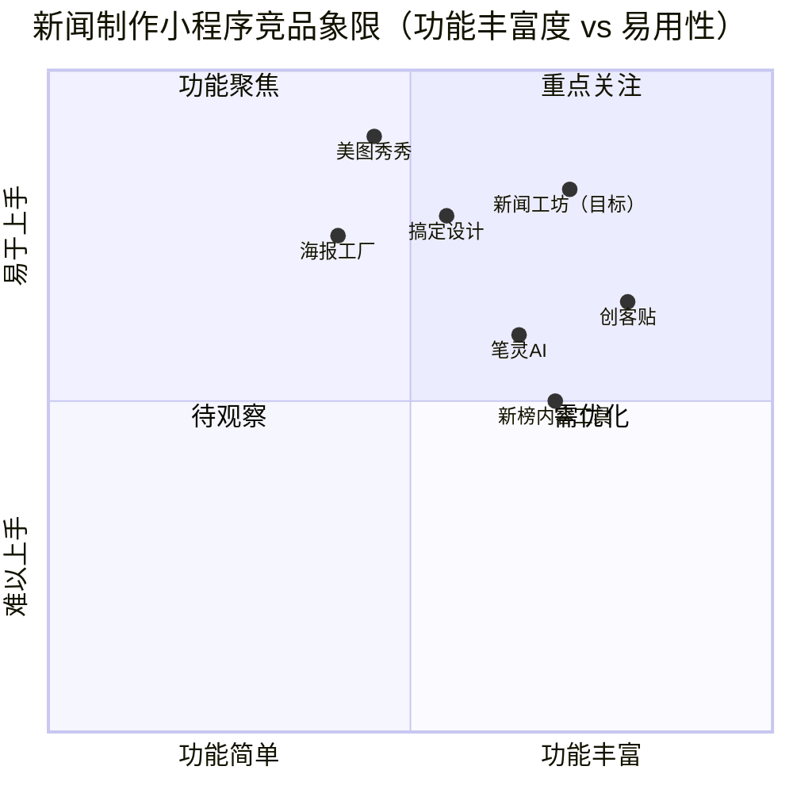

# PRD：新闻工坊 · 今日头条新闻制作微信小程序

| 字段 | 内容 |
|------|------|
| **文档版本** | v1.0 |
| **产品经理** | 许清楚 |
| **创建日期** | 2025-07-15 |
| **项目代号** | toutiao-news-maker |
| **平台** | 微信小程序 |
| **技术栈** | 微信原生小程序（WXML/WXSS/JS）+ 云开发（CloudBase） |
| **文档状态** | 待评审 |

---

## 目录

1. [产品目标](#1-产品目标)
2. [用户故事](#2-用户故事)
3. [功能需求池](#3-功能需求池)
4. [页面结构与交互设计](#4-页面结构与交互设计)
5. [非功能需求](#5-非功能需求)
6. [UI 设计概要](#6-ui-设计概要)
7. [竞品分析](#7-竞品分析)
8. [待确认问题](#8-待确认问题)

---

## 1. 产品目标

### 1.1 核心价值主张

> 让每一个普通人，都能在 60 秒内生成一条专业级的今日头条风格新闻，实现内容分发与自媒体变现。

| 目标维度 | 描述 |
|----------|------|
| **用户价值** | 降低自媒体内容生产门槛，零基础用户可快速制作符合今日头条风格的图文新闻 |
| **商业价值** | 通过积分消耗 + 会员订阅双轨制实现变现，广告激励补充收入 |
| **生态价值** | 构建题材内容库（UGC + PGC），形成用户持续创作与传播的内容飞轮 |

### 1.2 目标用户群体

| 用户类型 | 画像描述 | 核心诉求 |
|----------|----------|----------|
| **自媒体运营者** | 运营今日头条/抖音/视频号账号，需要高频稳定输出内容 | 效率、批量生产、分发便捷 |
| **内容创业者** | 刚入局自媒体，缺乏内容生产经验和设计能力 | 低门槛、模板丰富、专业感 |
| **企业新媒体** | 中小企业市场/品宣岗，负责公司自媒体账号维护 | 品牌定制、多题材覆盖 |
| **普通兴趣用户** | 对某一垂直领域（体育/美食/娱乐等）有热情，偶尔制作分享 | 好玩、分享社交 |

### 1.3 商业模式概述

```
收入结构
├── 积分购买（一次性消费）：用积分兑换单次制作/高级模板
├── 会员订阅（周期性收入）：月卡 / 季卡 / 年卡，无限制使用所有功能
├── 激励广告（广告收入）：观看广告获得免费积分，平台获得广告分成
└── 未来扩展：企业版定制服务、版权内容授权
```

---

## 2. 用户故事

### 2.1 普通用户场景

| # | 用户故事 | 验收标准 |
|---|----------|----------|
| US-01 | 作为一名自媒体新手，我想浏览按题材分类的新闻模板，以便快速找到适合我账号方向的内容 | 首页展示9大分类导航，每类至少实时更新20条以上内容 |
| US-02 | 作为普通用户，我想通过每日签到和观看广告免费获取积分，以便在不付费的情况下体验新闻制作功能 | 每日签到+1至+5积分，每次激励广告+2积分，每天上限10积分 |
| US-03 | 作为内容创作者，我想选择一个模板后，修改标题、正文、配图，预览效果后一键生成，以便快速产出今日头条风格的新闻图片/卡片 | 制作流程不超过5步，从选模板到生成完成≤60秒 |
| US-04 | 作为普通用户，我想将制作好的新闻一键保存到相册或分享到微信，以便传播我的内容 | 支持保存长图、转发小程序卡片、复制文字三种方式 |
| US-05 | 作为用户，我想在个人中心查看我的历史作品，以便复用或二次编辑 | 我的作品列表按时间倒序，支持删除和再编辑 |

### 2.2 VIP / 会员用户场景

| # | 用户故事 | 验收标准 |
|---|----------|----------|
| US-06 | 作为会员用户，我想无限制使用所有题材的全部模板，无需消耗积分，以便高效批量生产内容 | 会员身份验证通过后，所有积分墙入口自动解锁 |
| US-07 | 作为会员用户，我想使用专属的高级模板（带动态效果/水印去除/独家题材），以便制作出更专业、差异化的内容 | 会员专属模板数量≥普通模板数量的30%，标有"VIP"角标 |
| US-08 | 作为会员用户，我想优先获取每分钟更新的最新热点新闻，以便抢占热点发布时机 | 会员用户内容刷新延迟≤1分钟，普通用户延迟≤5分钟 |

### 2.3 内容消费与分发场景

| # | 用户故事 | 验收标准 |
|---|----------|----------|
| US-09 | 作为用户，我想在题材库中按"精选/热门/最新"筛选，以便发现当下最有传播潜力的新闻模板 | 三个Tab各自独立排序逻辑，精选由运营标注，热门按制作量排序 |
| US-10 | 作为用户，我想搜索特定关键词（如"世界杯""新能源"）快速定位相关新闻，以便制作垂直内容 | 搜索响应≤500ms，支持标题和内容全文搜索 |

---

## 3. 功能需求池

### 优先级定义

| 优先级 | 含义 |
|--------|------|
| **P0** | 必须有（MVP核心功能，缺失则产品无法上线） |
| **P1** | 应该有（重要功能，影响核心体验，第一版迭代完成） |
| **P2** | 可以有（增强功能，后续版本迭代） |

### 3.1 内容库模块

| ID | 需求描述 | 优先级 | 备注 |
|----|----------|--------|------|
| F-C01 | 9大题材分类：体育、汽车、三农、财经、科技、国际、房产、娱乐、美食 | P0 | 初版每类≥50条内容 |
| F-C02 | 内容实时更新，会员刷新间隔≤1分钟，普通用户≤5分钟 | P0 | 对接新闻API或AI生成 |
| F-C03 | 内容三分类展示：精选 / 热门 / 最新 | P0 | |
| F-C04 | 关键词全文搜索 | P1 | 响应≤500ms |
| F-C05 | 内容收藏功能（收藏夹） | P1 | |
| F-C06 | 内容举报/反馈 | P1 | 合规要求 |
| F-C07 | 猜你喜欢（基于历史制作记录推荐） | P2 | 需积累用户数据 |
| F-C08 | 热点榜单（今日热搜词+对应新闻） | P2 | |

### 3.2 新闻制作模块

| ID | 需求描述 | 优先级 | 备注 |
|----|----------|--------|------|
| F-M01 | 模板选择（每类≥10个风格模板） | P0 | |
| F-M02 | 标题编辑（字数限制、字体、颜色） | P0 | |
| F-M03 | 正文编辑（富文本，支持加粗/换行） | P0 | |
| F-M04 | 配图替换（从相册选图 / 使用模板默认图） | P0 | |
| F-M05 | 实时预览（所见即所得） | P0 | |
| F-M06 | 一键生成新闻图片（长图/卡片图） | P0 | 保存到相册 |
| F-M07 | 分享：转发小程序卡片 + 复制文字 | P0 | |
| F-M08 | 水印控制（普通版带水印，会员无水印） | P0 | |
| F-M09 | 题材标签自动识别与打标 | P1 | |
| F-M10 | 历史草稿自动保存（最近20条） | P1 | |
| F-M11 | AI 一键改写（输入关键词，AI生成新闻正文） | P1 | 消耗双倍积分 |
| F-M12 | 视频新闻制作（图文转视频，配音） | P2 | |
| F-M13 | 批量制作（一次选多个模板） | P2 | 仅会员 |

### 3.3 积分系统模块

| ID | 需求描述 | 优先级 | 备注 |
|----|----------|--------|------|
| F-P01 | 积分账户（余额显示、明细流水） | P0 | |
| F-P02 | 每日签到得积分（连续签到有奖励） | P0 | 每日+1至+5分 |
| F-P03 | 观看激励广告得积分 | P0 | 每次+2分，每日上限5次 |
| F-P04 | 制作新闻消耗积分（普通模板-2分，AI功能-5分） | P0 | |
| F-P05 | 积分购买（微信支付，多档套餐） | P0 | 见积分套餐表 |
| F-P06 | 邀请好友得积分（被邀请人首次使用+10分） | P1 | |
| F-P07 | 积分兑换实物/优惠券（积分商城） | P2 | |

**积分套餐参考：**

| 套餐 | 积分数 | 价格 | 单价 |
|------|--------|------|------|
| 体验包 | 30 分 | ¥3 | ¥0.10/分 |
| 标准包 | 100 分 | ¥8 | ¥0.08/分 |
| 超值包 | 300 分 | ¥18 | ¥0.06/分 |
| 专业包 | 1000 分 | ¥48 | ¥0.048/分 |

### 3.4 会员系统模块

| ID | 需求描述 | 优先级 | 备注 |
|----|----------|--------|------|
| F-V01 | 会员购买页（月卡/季卡/年卡，微信支付） | P0 | |
| F-V02 | 会员特权展示（对比普通/会员权益） | P0 | |
| F-V03 | 会员到期提醒（提前3天推送） | P0 | |
| F-V04 | 会员标识（头像角标、专属昵称框） | P1 | |
| F-V05 | 会员专属模板库 | P1 | ≥30个专属模板 |
| F-V06 | 连续包月自动续费 | P1 | 微信自动扣费 |
| F-V07 | 团队/企业版（多账号共享） | P2 | |

**会员套餐参考：**

| 类型 | 时长 | 价格 | 日均成本 |
|------|------|------|----------|
| 月卡 | 30天 | ¥18 | ¥0.60/天 |
| 季卡 | 90天 | ¥42 | ¥0.47/天 |
| 年卡 | 365天 | ¥128 | ¥0.35/天 |

### 3.5 用户账户模块

| ID | 需求描述 | 优先级 | 备注 |
|----|----------|--------|------|
| F-U01 | 微信授权登录（获取头像、昵称） | P0 | |
| F-U02 | 个人信息编辑（昵称、头像） | P0 | |
| F-U03 | 我的作品列表（支持删除、再编辑、分享） | P0 | |
| F-U04 | 我的收藏（模板收藏 + 内容收藏） | P1 | |
| F-U05 | 消息通知（系统通知、活动通知） | P1 | |
| F-U06 | 账号注销 | P1 | 合规要求 |
| F-U07 | 用户等级体系（青铜→钻石，根据创作量升级） | P2 | |

---

## 4. 页面结构与交互设计

### 4.1 整体页面架构

```
小程序页面结构
│
├── 【TabBar 底部导航】
│   ├── 首页（新闻流）
│   ├── 题材库
│   ├── 制作（中间主功能按钮，突出显示）
│   ├── 积分
│   └── 我的
│
├── 首页（/pages/home/home）
│   ├── 顶部搜索栏 + 通知图标
│   ├── Banner 轮播（活动/热点）
│   ├── 题材分类 Tab（横向滚动）
│   └── 新闻流列表（瀑布流/卡片流）
│
├── 题材库（/pages/category/category）
│   ├── 左侧分类导航（9大题材）
│   └── 右侧内容列表（精选/热门/最新 Tab）
│
├── 新闻制作（/pages/make/make）
│   ├── Step 1：选择题材 & 模板
│   ├── Step 2：编辑内容（标题/正文/配图）
│   ├── Step 3：实时预览
│   └── Step 4：生成 & 分享
│
├── 积分中心（/pages/points/points）
│   ├── 积分余额卡片
│   ├── 获取积分方式（签到/广告/购买）
│   └── 积分流水明细
│
├── 会员中心（/pages/vip/vip）
│   ├── 会员权益对比
│   ├── 套餐选择（月/季/年）
│   └── 开通/续费按钮
│
├── 个人中心（/pages/profile/profile）
│   ├── 用户信息 + 会员状态
│   ├── 我的作品
│   ├── 我的收藏
│   └── 设置（通知/客服/注销）
│
└── 支付页（/pages/pay/pay）
    ├── 订单详情
    ├── 支付方式（微信支付）
    └── 支付结果反馈
```

### 4.2 核心流程：新闻制作流程

```
用户进入制作页
        ↓
选择题材分类（9选1）
        ↓
浏览并选择新闻模板
        ↓
[积分检查] ──── 积分不足 ──→ 弹出积分充值/会员开通引导
        ↓ 积分充足 / 会员用户
编辑新闻内容
├── 修改标题
├── 编辑正文（可使用AI改写，消耗积分）
└── 替换配图
        ↓
实时预览效果
        ↓
确认生成（扣除积分）
        ↓
生成成功 → 保存相册 / 转发分享 / 查看我的作品
```

### 4.3 关键页面详细描述

#### 首页

```
┌─────────────────────────────┐
│ 🔍 搜索新闻关键词...    🔔  │  ← 顶部搜索栏
├─────────────────────────────┤
│  [Banner 活动轮播区]         │  ← 高度约 160px
├─────────────────────────────┤
│ 全部 体育 汽车 三农 财经 →  │  ← 分类 Tab 横向滚动
├─────────────────────────────┤
│ ┌──────┐ 标题文字（2行）     │
│ │ 封面 │ 来源 · 时间 · 热度  │  ← 新闻卡片（左图右文）
│ └──────┘                     │
│ ┌──────┐ 标题文字（2行）     │
│ │ 封面 │ 来源 · 时间 · 热度  │
│ └──────┘                     │
│           ...                │
├─────────────────────────────┤
│  🏠首页  📚题材  ✨制作  💎积分  👤我的  │  ← TabBar
└─────────────────────────────┘
```

#### 新闻制作页

```
┌─────────────────────────────┐
│ ← 新闻制作        Step 2/4  │  ← 进度指示
├─────────────────────────────┤
│ [模板预览大图区]             │  ← 可缩放预览
├─────────────────────────────┤
│ 标题：[__________________]  │  ← 可编辑输入框
│ 正文：[__________________]  │
│       [    AI改写(-5分)   ] │  ← AI功能入口
│ 配图：[选择图片]            │
├─────────────────────────────┤
│ [实时预览]    [下一步 →]    │
└─────────────────────────────┘
```

#### 积分中心页

```
┌─────────────────────────────┐
│ 积分中心                     │
├─────────────────────────────┤
│  ┌───────────────────────┐  │
│  │  我的积分：  288 分   │  │  ← 积分卡片
│  │  [去购买积分]         │  │
│  └───────────────────────┘  │
├─────────────────────────────┤
│ 获取积分                     │
│ ✅ 今日签到（+3分）[已签到]  │
│ 📺 看广告得积分（+2分）      │
│ 👥 邀请好友（+10分）         │
│ 💰 购买积分套餐              │
├─────────────────────────────┤
│ 积分明细                     │
│ 2025-07-15  签到       +3   │
│ 2025-07-15  制作新闻   -2   │
│ 2025-07-14  购买积分  +100  │
└─────────────────────────────┘
```

---

## 5. 非功能需求

### 5.1 性能要求

| 指标 | 要求 |
|------|------|
| 首屏加载时间 | ≤ 2秒（4G网络） |
| 新闻列表刷新 | ≤ 1秒 |
| 搜索响应时间 | ≤ 500ms |
| 新闻图片生成时间 | ≤ 10秒 |
| 内容更新频率 | 会员≤1分钟，普通用户≤5分钟 |
| 同时在线用户支持 | ≥ 1万（初版），可水平扩容 |
| 小程序包体积 | 主包≤2MB，分包合理拆分 |

### 5.2 安全要求

| 类别 | 要求 |
|------|------|
| **用户隐私** | 严格遵循微信小程序隐私协议，用户数据不出境，获取授权前充分告知 |
| **支付安全** | 所有支付通过微信官方支付API，服务端验签，防止重放攻击 |
| **内容合规** | 新闻内容经过敏感词过滤，用户自定义内容入库前审核（人工+AI） |
| **积分防刷** | 签到/广告积分加设备指纹+频率限制，防止恶意刷积分 |
| **接口安全** | 全部接口使用 HTTPS，敏感接口加 Token 验证 + 频率限流 |
| **数据备份** | 用户作品数据每日全量备份，保留最近30天快照 |
| **版权合规** | 内容库新闻素材需持有合规版权或通过AI生成，避免直接抓取版权内容 |

### 5.3 兼容性要求

| 项目 | 要求 |
|------|------|
| 微信版本 | 支持微信 8.0+ |
| 系统版本 | iOS 13+ / Android 8.0+ |
| 屏幕适配 | 兼容主流机型（375px ~ 414px 宽度，以及折叠屏） |

---

## 6. UI 设计概要

### 6.1 整体设计风格

| 要素 | 规范 |
|------|------|
| **设计风格** | 今日头条风格，简洁、信息密度高、强调阅读效率 |
| **主色调** | 主红 `#E8002D`（头条红）+ 深黑 `#1A1A1A` |
| **背景色** | 页面背景 `#F5F5F5`，卡片白 `#FFFFFF` |
| **辅助色** | 成功绿 `#07C160`，警示橙 `#FA8C16`，VIP金 `#FAAD14` |
| **字体** | 标题：PingFang SC Semi-Bold，正文：PingFang SC Regular |
| **字号** | 主标题 17px，副标题 15px，正文 14px，辅助信息 12px |
| **圆角** | 卡片 8px，按钮 4px，标签 12px |
| **图标风格** | 线面结合，与头条系产品视觉一致 |

### 6.2 核心视觉元素

- **头条红**贯穿全局：TabBar 选中状态、按钮主色、重要标签背景均使用头条红
- **卡片式布局**：新闻内容以卡片展示，白底投影，清晰分区
- **VIP 金色标识**：VIP 相关元素（角标、会员卡、专属模板）统一使用金色系
- **制作按钮突出**：底部 TabBar 中间"制作"按钮放大 + 红色背景，视觉重心突出
- **积分数字动效**：积分增减时有轻量动画反馈，增强用户获得感

### 6.3 新闻模板风格举例

| 模板风格 | 描述 | 适用题材 |
|----------|------|----------|
| 头版头条 | 红色顶部bar + 大图 + 粗标题 | 国际、财经 |
| 快讯闪报 | 黑底白字，极简风格 | 体育、科技 |
| 温情叙事 | 浅暖色调，图文混排 | 三农、美食 |
| 娱乐爆料 | 渐变背景，活泼字体 | 娱乐 |
| 数据图表 | 信息图样式，含数据可视化 | 财经、房产 |

---

## 7. 竞品分析



| 竞品 | 优势 | 劣势 | 对我们的启示 |
|------|------|------|-------------|
| **创客贴** | 模板量大、PC端强大 | 小程序体验弱、无新闻垂类 | 新闻题材垂直化是差异点 |
| **搞定设计** | 操作流畅 | 内容库无实时更新 | 实时热点是核心壁垒 |
| **美图秀秀** | 用户基数大、易用 | 不聚焦新闻内容 | 易用性要对标美图 |
| **新榜内容工具** | 专业自媒体向 | 价格高、门槛高 | 下沉市场机会 |
| **海报工厂** | 微信生态原生 | 功能简单、模板老旧 | 微信分发链路要打通 |

---

## 8. 待确认问题

| # | 问题 | 影响范围 | 决策方 | 优先级 |
|---|------|----------|--------|--------|
| Q1 | **内容来源**：新闻内容库是接入第三方新闻API（如聚合数据、天行数据）还是自建AI生成内容？版权风险如何规避？ | F-C02，上线合规性 | 产品+法务 | 🔴 高 |
| Q2 | **积分初始赠送**：新用户注册是否赠送初始积分（如10分）以降低冷启动门槛？ | 用户转化率 | 产品+运营 | 🟡 中 |
| Q3 | **AI 改写功能**：使用哪家AI大模型API（OpenAI/文心/通义等）？调用成本如何与积分定价匹配？ | F-M11，成本核算 | 产品+技术 | 🔴 高 |
| Q4 | **内容审核**：用户自定义的新闻标题/正文是否需要入库审核？若需要，审核延迟对用户体验影响如何接受？ | 合规，用户体验 | 产品+法务 | 🔴 高 |
| Q5 | **水印方案**：普通用户水印的位置、样式及透明度如何设定？是否会影响用户分享意愿？ | F-M08，品牌曝光 | 产品+设计 | 🟡 中 |
| Q6 | **会员自动续费**：是否上线连续包月自动续费功能？需走微信特殊审核，开发周期是否影响首版上线？ | F-V06，收入 | 产品+技术 | 🟡 中 |
| Q7 | **最低制作分辨率**：生成的新闻图片最低分辨率要求是多少（建议1080px宽）？文件大小上限？ | F-M06，技术实现 | 产品+技术 | 🟢 低 |
| Q8 | **题材扩展计划**：初版9大题材之后，是否有规划更多垂直题材（如游戏、教育、健康）？题材扩展的运营资源？ | 内容策略，路线图 | 产品+运营 | 🟢 低 |

---

## 附录：术语表

| 术语 | 说明 |
|------|------|
| **题材** | 新闻内容所属的垂直领域分类，如体育、财经等 |
| **模板** | 预设的新闻图文排版样式，用户可在其基础上编辑内容 |
| **积分** | 平台虚拟货币，用于消费新闻制作功能，可通过签到/广告/购买获取 |
| **会员** | 订阅制付费用户，享有无限制使用权及专属特权 |
| **AI改写** | 利用大语言模型，基于关键词或原文生成新闻正文 |
| **题材库** | 按垂直题材分类存储的新闻内容与模板集合 |
| **水印** | 普通用户生成图片上附带的平台品牌标识 |

---

*文档由产品经理 许清楚 起草，版本 v1.0，2025-07-15*  
*如有疑问请通过项目协作系统反馈，重大变更需重新评审。*
